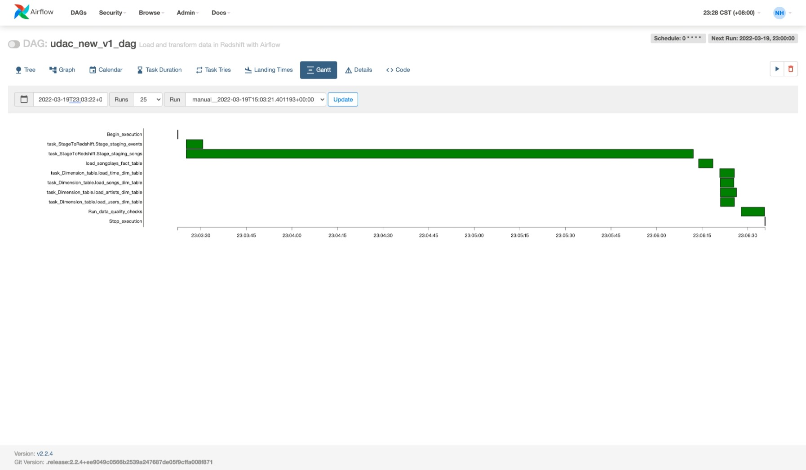
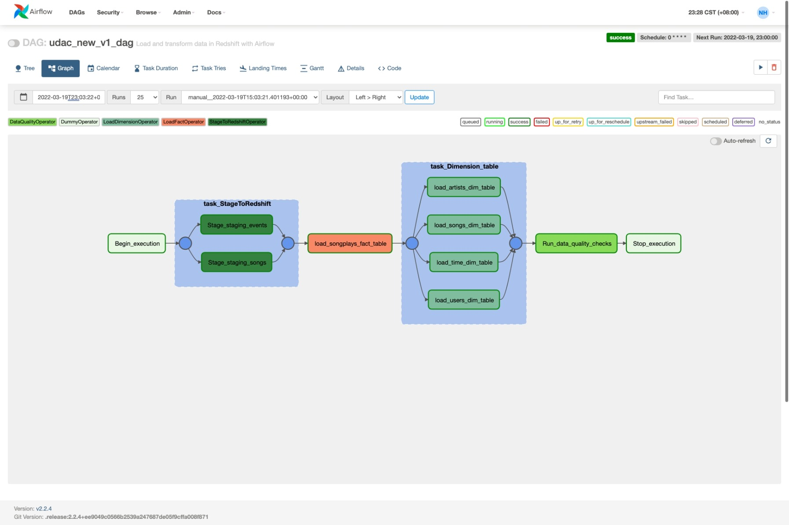

# Project - Airflow data pipeline

## Abstract
---
A music stream company, Sparkify, has decided  that to monitoring to their data warehouse ETL pipelines that tool is Apache Airflow.

The source data resides in S3 and needs to be processed in Sparkify's data warehouse in Amazon Redshift. The source datasets consist of JSON logs that tell about user activity in the application and JSON metadata about the songs the users listen to.

## Project Steps
---
### Install and Launch Airflow in local machine

- Main package of Airflow version
1. Airflow 2.2.4
2. Python 3.9
3. Postgres 12

### Instruction this project
- Instruction each project files function:
1. DAG task ```/dags/udac_v1.py```
It's the main task of this project to launch Airflow DAG processing and make sure all ETL pipeline processing.
<br/>
2. Configuration ```./config_file/airflow.cfg```
Setting all airflow configurations for making sure that is working or not.
<br/>
3. Project folders
```
-> /dags
    -> udac_v1.py

   /config_file
   -> airflow.cfg
   -> constraints-3.9.txt
   -> requirements.txt

   /plugins
   -> /helpers
    -> __init__.py
    -> sql_queries.py
   -> /others
        -> __init__.py
        -> data_quality.py
        -> load_dimension.py
        -> load_fact.py
        -> stage_redshift.py
```
### DAG execute all processing time
- It's data from s3 to aws redshift process.

## Data Check Result
---
- Compare with expected and actual results: Using point1 and 2 to check data quality is correctly or not.

1. Generally data check sql statement
```sql
SELECT COUNT(*) FROM {table_name} WHERE {condation} IS NULL
```

2. Expected results format
```sql
expected_count = \
'''
{
    "songplays": 0,
    "songs": 0,
    "users": 0,
    "time": 0,
    "artists": 0
}
'''
```

- It's DAG graph of result


